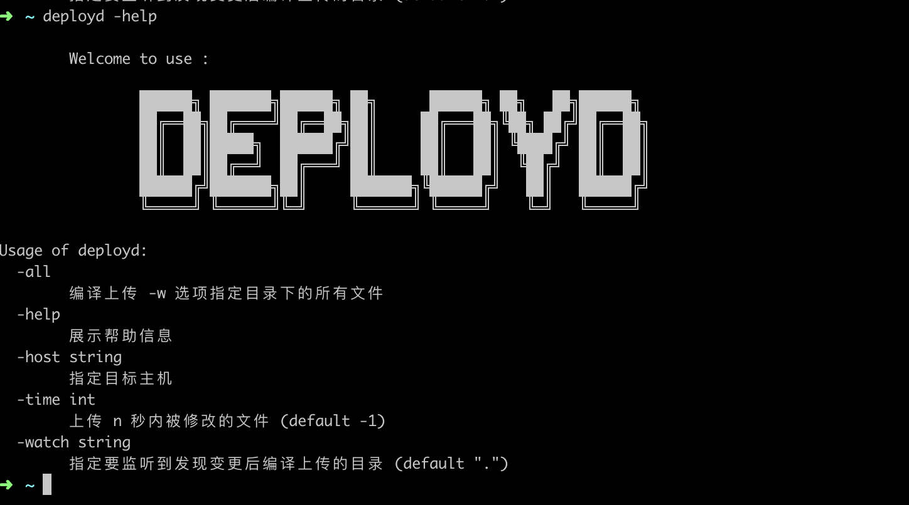

# 一、简介

这是一个简单的代码部署和服务器快速登陆的工具。

**收益**

| 收益                                   |
| --                                     |
| 避免频繁的OTP验证码的输入,提升工作效率 |
| 将不同的开发测试机器统一管理           |

**下载地址如下：**

- [TOOLS](https://github.com/Pengfei-Gao/deployd)


**使用`deployd`工具监听目录下文件变动实时上传示例如下：**


**展示帮助信息：**



# 二、安装

将工具拷贝一个副本到本地，然后将其加入环境变量：

```bash
git clone https://github.com/Pengfei-Gao/deployd.git  ${HOME}/.tools

cd .tools

mv deploy.ini.example deploy.ini
```


依赖说明如下：

| 依赖                         | 说明                                        | 下载地址                                    |
| --                           | --                                          | --                                          |
| expect                       | 用于登录中控机                              | [Address](https://core.tcl.tk/expect/index) |
| php                          | 计算OTP动态口令                             | [Address](http://www.php.net/)              |
| grep/sed/awk 等常用shell指令 | -                                           | -                                           |
| tmux                         | 一个强大的终端管理工具（session复用）       | -                                           |
| goland                       | `deployd`服务使用go编写，需要编译后才能使用 | -                                           |

# 三、使用


**ptdeploy参数说明如下：**

| 参数 | 说明                                                                                                          |
| --   | --                                                                                                            |
| -h   | 指定主机名                                                                                                    |
| -m   | 指定上传模式： git(当前的工作目录中修改的文件)、time(时间模式。最近修改的文件)、all(上传当前目录下的所有文件) |
| -t   | 指定时间范围。以天或分钟为单位                                                                                |


**deployd说明如下：**

`deployd`指令使用`golang`编写，需要编译以后才能使用：

```bash
go build deployd.go
```

| 参数   | 说明                       |
| --     | --                         |
| -host  | 指定主机名                 |
| -watch | 监听哪个目录               |
| -help  | 展示帮助信息               |
| -all   | 上传 -watch 指定的所有文件 |
| -time  | 上传 n 秒内被修改的文件    |

**使用说明：**

```bash
# 部署代码

# 使用all模式上传；会上传所有文件;可使用-h参数指定主机名
ptdeploy [机器名]
ptdeploy test30
ptdeploy test311
ptdeploy -htest311 -mall

# 使用git模式上传；该模式只会上传在git中变更的文件； 注意：git为跟踪的文件不会上传
ptdeploy -htest311 -mgit

# 使用time模式上传；该模式只会上传最近变更的文件；默认上传24小时内变更的文件
ptdeploy -htest311 -mtime 

# 使用time模式上传；上传48小时内变更的文件
ptdeploy -htest311 -mtime -t1 

# 使用time模式上传；上传1分钟内变更的文件
ptdeploy -htest311 -mtime -t-1 

# 使用time模式上传；上传72小时内变更的文件
ptdeploy -htest311 -mtime -t2

# 使用time模式上传；上传2分钟内变更的文件
ptdeploy -htest311 -mtime -t-2

# 使用time模式上传；上传 n x 24 小时内变更的文件;注意，n为整数
ptdeploy -htest311 -mtime -tn

# 使用time模式上传；上传 n x 1 分钟内变更的文件;注意，n为整数
ptdeploy -htest311 -mtime -t-n


ptgoto [机器名]

# 登录跳板机
ptgoto relay


# 登录不需要通过跳板机登陆的机器
ptgoto test30
ptgoto test311

# 登录需要通过跳板机登陆的机器
ptgoto online # 中控机 查日志
ptgoto test13
ptgoto tips
ptgoto tips2 

# 登录线上备库
ptgoto dbnative
ptgoto dbmacan
ptgoto dbpet
...

# 登入test30的redis
ptgoto redis-test30


# 后台常驻模式
# 实时监听当前目录的文件变更，若变更则上传的目标机器（test311）
deployd -host test311 -watch .

# 展示帮助信息
deployd -help

# 上传 3600 秒内被修改的文件
deployd -time 3600 -watch . -host test311

# 上传所有文件
deployd -all -watch . -host test311

# 监听8000端口，提供文件上传服务
deployd -listen 0:8000
```


**新增机器**

```bash
vim conf/deploy.ini
```

**配置**

`global`为全局配置，字段说明见下表：

| 字段       | 类型   | 说明                                                                                                                                          |
| --         | --     | --                                                                                                                                            |
| global     | array  | 全局配置规则块                                                                                                                                |
| code_home  | string | 代码存放目录，即开发工作目录                                                                                                                  |
| doc_home   | string | 文档存放目录                                                                                                                                  |
| otp_key    | string | 入职时OTP授权的二维码内容中的secret字段，示例：otpauth://totp/gaopengfei01@xxx.com?secret=`XXXXXXXXXXXXXXXXX`&issuer=relay.xxx.cc |
| username   | string | Cas登录用户名                                                                                                                                 |
| userpass   | string | Cas登录密码                                                                                                                                   |
| relay      | string | 跳板机地址，一般默认为`relay.xxxx.cc`                                                                                                    |
| odp_path   | string | 开发机上的工作目录                                                                                                                            |
| my_machine | string | 默认机器。当`ptdeploy`未指定目标机器时，将直接使用该默认机器                                                                                  |

其余配置均为机器的配置，字段说明如下：


| 字段     | 类型    | 说明                                                            |
| --       | --      | --                                                              |
| machine  | string  | 要登录的目标机器，包括用户名和ip                                |
| password | string  | 机器的登录密码，如果机器是通过relay来完成授权登陆的，可不填     |
| relay    | boolean | 是否需要通过relay（跳板机）登录                                 |
| secret   | string  | 用于计算签名的秘钥                                              |
| command  | string  | 登录机器后要立即执行的指令，例如登入线上备库：`ptgoto dbnative` |

示例如下：

```
[global]
code_home = /root/workspace/code 
doc_home  = /root/workspace/document
relay     = relay.xxx.cc
otp_key   = "YOUR-OTP-KEY"
username  = "YOUR-USER-NAME"
userpass  = "YOUR-PASS-WORD"
odp_path  = /home/homework
my_machine= test311


[test311]
machine  = homework@192.168.241.131
password = MhxzKhl
relay    = false
secret   = 

[test30]
machine  = homework@192.168.240.91
password = MhxzKhl
relay    = false
secret   = 

[test13]
machine  = homework@192.168.240.90
password =
relay    = true
secret   = 

[online]
machine  = rd@192.168.0.122
password =
relay    = true
secret   = 

[dbnative]
machine  = homework@192.168.240.90
password =
relay    = true
command  = dbnativeapp

[redis-test30]
machine  = homework@192.168.241.131
password = MhxzKhl
relay    = true
secret   =
command  = redis-test30

```

# 三、签名校验

目前各测试机上传代码的`fisserver.php`存在一定安全隐患（上传文件没有做出明确的鉴权，可以上传任意的可执行shell脚本至测试机）。故通过对文件算签名来统一授权。目标如下：

- 提升内部测试环境安全性
- 防止代码被其他人覆盖，较少开发沟通损耗


下面提供两种用于计算签名的示例：

**Shell 版本：**

```bash
# 计算字符串的MD5值
function md5(){
    STR=$1                         # 入参，要计算MD5的字符串
    echo -n $STR | md5sum | sed s/\ //g | sed s/-//g
}

function md5_file(){
    FILE=$1
    md5sum $1 | awk '{print $1}'
}

# 签名计算函数
function getSign(){
    FILE=$1                         # 要上传的文件路径
    KEY=$2                          # 用于计算签名的秘钥
    FILE_MD5=$(md5_file $FILE)      # 计算文件的MD5值
    PLAIN_SIGN="$SECRET$FILE_MD5"
    SIGN=$(md5 $PLAIN_SIGN)
    echo $SIGN
}

SIGN=$(getSign $FILE_NAME $SECRET)
```

**PHP版本：**

```php

/**
 * @param  string $secret    秘钥
 * @param  string $filePath  文件路径
 * @return string $sign      签名
 */
function getSign($secret, $filePath){
    $fileMd5 = md5_file($filePath);
    return md5($secret.$fileMd5);
};

const SECRET = "d5xxxxxxxxxxxxxxxxxxxxxxxxxxxx";

$sign = getSign(SECRET, $_FILES["file"]["tmp_name"]);

```
